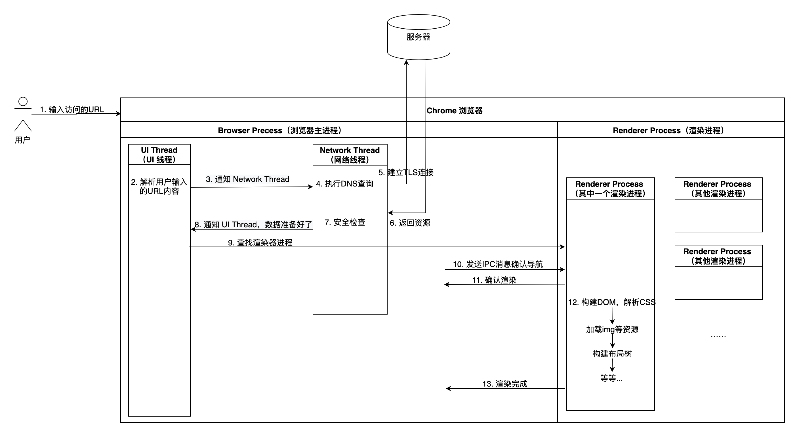

先读一下：[图解浏览器的基本工作原理](https://zhuanlan.zhihu.com/p/47407398)

然后根据自己的理解画一张简单的示意图

## Browser Process （浏览器进程）

1. 负责包括地址栏，书签栏，前进后退按钮等部分的工作；
2. 负责处理浏览器的一些不可见的底层操作，比如网络请求和文件访问；

### Browser Process 中的线程

- **UI Thread**, 控制浏览器上的按钮及输入框；

- **Network Thread**, 处理网络请求，从网上获取数据；

- **Storage Thread**, 控制文件等的访问；

## Renderer Process （渲染进程）

负责一个 tab 内关于网页呈现的所有事情。

## Plugin Process （插件进程）

负责控制一个网页用到的所有插件，如 flash。

## GPU Process （GPU 进程）

负责处理 GPU 相关的任务。
