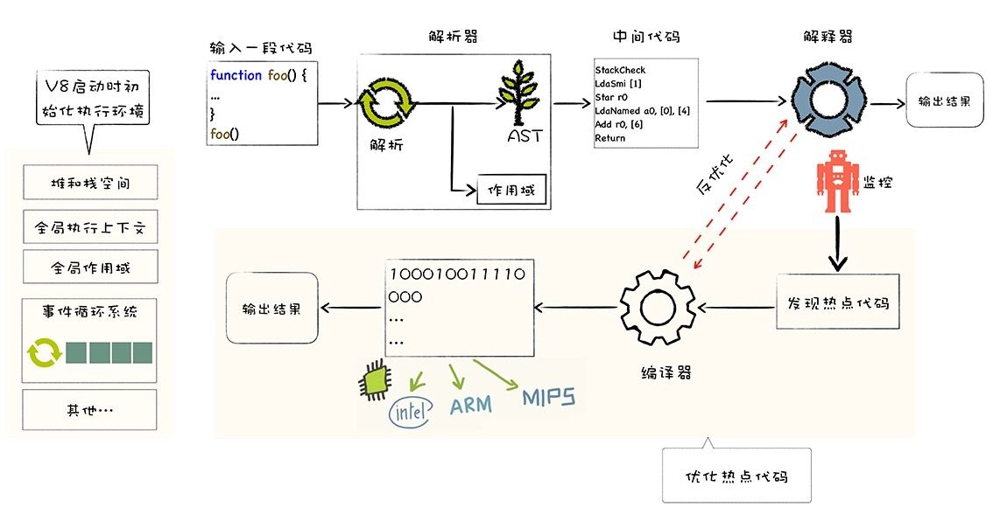

JS 有两种运行环境：**浏览器** 和 **NodeJS 环境**。

由于 JS 是一种解释型语言，需要 JS 引擎对其进行解释执行。

不同的浏览器采用不同的 JS 引擎，IE 老版本的 JScript，IE9 以后的 Chakra，Mozilla 的 SpiderMonkey，Chrome 的 V8，Safari 的 Nitro 等等。NodeJS 中的 JS 引擎也是 V8。

不同的 JS 引擎对 JS 的处理有所差别，以 V8 引擎为例，



1. V8 引擎启动时，会初始化堆栈空间、全局执行上下文、事件循环系统等等。

2. JS 源代码经过解析器解析成抽象语法树(AST)，同时将声明的变量和方法收集到全局作用域中。

3. AST 经过解释器编译成字节码(bytecode)，字节码与平台无关，能够在不同操作系统上运行。同时解释器也有直接解析执行字节码的能力。

4. 如果执行过程中发现有频繁使用的热点代码，那么编译器会将这部分代码编译生成对应平台的机器代码，下次再调用这部分代码时，则直接执行已经编译好的机器代码，提高执行性能。

## 示例代码

以下面一段 JS 代码为例

```js
var a = 1;
var b = a;
let c = 3;
const d = 4;

function fun1() {
  var fun1_a = "fa";
  return {
    getA: function() {
      return fun1_a;
    },
    setA: function(val) {
      fun1_a = val;
    },
  };
}
fun1();

function fun2() {}

var fun2 = "c";

console.log("fun2", fun2);
```

从 [抽象语法树](/blogs/javascript/ast.html) 开始，一步步详细理解。
