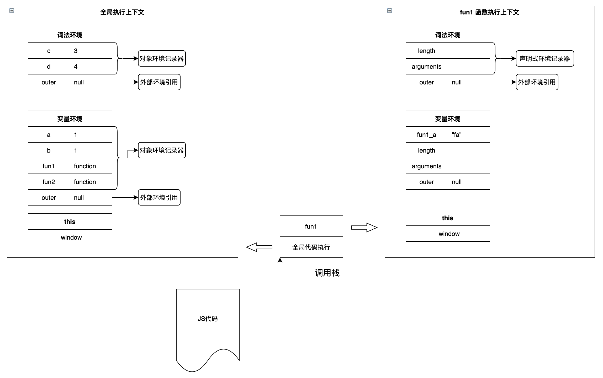

## 什么是执行上下文

JS 执行上下文(Execution Context，简称 EC)包括词法环境(LexicalEnvironment)、变量环境(VariableEnvironment)、this 等内容。它的作用是为 JS 代码的执行提供"准备工作"，因此执行上下文在代码执行之前生成。

以伪代码表示：

```js
ExecutionContext = {
  ThisBinding = <this value>,
  LexicalEnvironment = { ... },
  VariableEnvironment = { ... },
}
```

JS 中有三种执行上下文：

1. 全局执行上下文
2. 函数执行上下文
3. eval 执行上下文

执行上下文图示：



:::warning
JS 的相关概念以 ES6 为准。
:::

## 全局执行上下文

全局执行上下文只有一个，在客户端中一般由浏览器创建，也就是我们熟知的 window 对象，我们能通过 this 直接访问到它。

程序启动时，全局上下文被创建。

1. 创建全局上下文的**词法环境**

   创建**对象环境记录器**，它用来定义出现在全局上下文中的变量和函数的关系（负责处理 let 和 const 定义的变量）。

   创建**外部环境引用**，值为 null。

2. 创建全局上下文的**变量环境**

   创建**对象环境记录器**，它持有变量声明语句在执行上下文中创建的绑定关系（负责处理 var 定义的变量，初始值为 undefined 造成声明提升）。
   创建**外部环境引用**，值为 null。

3. 确定 this 值为全局对象（以浏览器为例，就是 window ）。

## 函数执行上下文

函数被调用，函数上下文被创建。

1. 创建函数上下文的**词法环境**

   创建**声明式环境记录器**，存储变量、函数和参数，它包含了一个传递给函数的 arguments 对象（此对象存储索引和参数的映射）和传递给函数的参数的 length。（负责处理 let 和 const 定义的变量）。

   创建**外部环境引用**，值为全局对象，或者为父级词法环境（作用域）。

2. 创建函数上下文的**变量环境**

   创建**声明式环境记录器**，存储变量、函数和参数，它包含了一个传递给函数的 arguments 对象（此对象存储索引和参数的映射）和传递给函数的参数的 length。（负责处理 var 定义的变量，初始值为 undefined 造成声明提升）。

   创建**外部环境引用**，值为全局对象，或者为父级词法环境（作用域）。

3. 确定 this 值

## eval 执行上下文

暂时略过。

## 作用域

作用域是一个抽象的概念，是一套规则，用于确定在何处以及如何查找变量。如果要查找一个作用域下某个变量的值，就需要找到这个作用域对应的执行上下文环境，再在其中找到变量的值。

作用域在解析生成抽象语法树的时候就生成了。作用域包括全局作用域、函数作用域、块级作用域，全局作用域在 JS 引擎初始化时就确定了，函数作用域在函数声明(不是调用)的时候就确定了。ES6 之前 JS 没有块级作用域，在 ES6 中可以通过 let 和 const 实现块级作用域。

作用域最大的作用就是隔离变量，不同作用域下同名的变量也不会有冲突。

### 作用域规则

- 对于 var 声明的变量，如果当前作用域中已经存在，则直接略过；如果不存在，则

## 执行上下文 VS 作用域

1. 作用域在定义时确定，并且不会发生改变。执行上下文在运行时确定，随时可能改变(比如 this 的指向)。
2. 同一个作用域下，不同的调用会产生不同的执行上下文环境。
