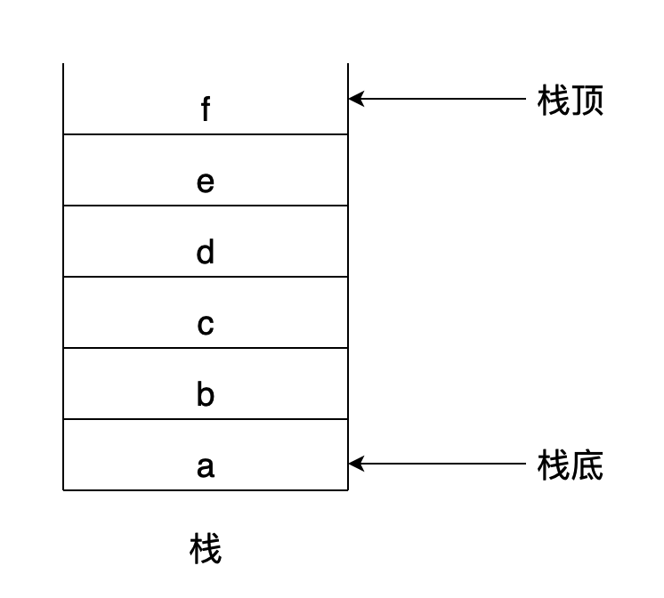
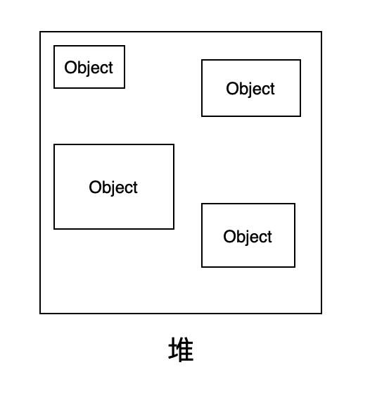
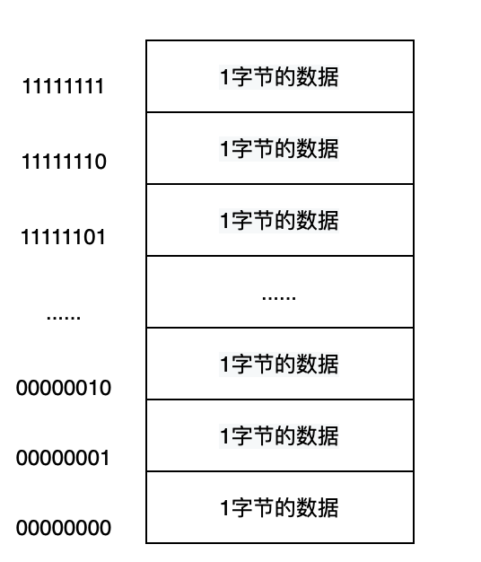

## 栈（Stack）

栈是计算机中的一种数据结构，像杯子一样，只有一个开口。具有**先进后出**的特点。



**入栈顺序：** a -> b -> c -> d -> e -> f

**出栈顺序：** f -> e -> d -> c -> b -> a

### 栈的作用

- 存放原始类型数据

  JS 中[数据类型](/blogs/javascript/data-type.html)分为两类：原始类型(基本类型)、引用类型(复合类型)。原始类型存储在栈内存，引用类型存储在堆内存。

- 提供 JS 代码执行环境

  JS 代码执行的时候会按顺序进栈执行，执行完毕后出栈。

  :::warning
  注意，全局上下文的出栈只有页面关闭的时候才会进行。
  :::

## 堆（Heap）

堆内存存放引用类型数据，比如数组、对象、方法等。存储的数据大小一般都是未知的，在运行时才进行内存分配。



## 内存（Memory）

计算机中位（bit，也称为比特）是最小的单位，字节（byte）是数据处理的基本单位。1B = 8b。



一个具有 A0~A9 共十个数据引脚的内存 IC，可以提供 0000000000 ~ 1111111111，即 2^10^=1024 个存储地址。可以存储 1024 个 1 字节的数据，即 1KB 的数据。

🌰 例如执行下面简单的赋值语句：

```js
var a = 1;
```

代码运行时，首先为变量 a 分配一个内存地址，然后将数字 1 存储到该地址中。

:::warning
JS 源代码存储在计算机的磁盘中，程序执行的时候，需要将其读入内存中才能解析执行。
:::

---

参考：

- [JS 内存模型](https://www.cnblogs.com/fayin/p/10763689.html)
