## 基础知识

### 网络类型

#### 按网络的作用范围进行分类

1. 广域网 WAN (Wide Area Network) ，作用范围通常为几十到几千公里
2. 城域网 MAN (Metropolitan Area Network) ，作用范围一般是一个城市，可跨越几个街区甚至整个的城市，其作用距离约为 5 ～ 50km。
3. 局域网 LAN (Local Area Network)，一般用微型计算机或工作站通过高速通信线路相连（速率通常在 10Mb/s 以上），但地理上则局限在较小的范围（如 1km 左右）。比如学习、企业等内部网络。
4. 个人区域网 PAN (Personal Area Network)，就是在个人工作的地方把属于个人使用的电子设备（如便携式电脑等）用无线技术连接起来的网络，因此也常称为无线个人区域网 WPAN(Wireless PAN)，其范围大约在 10 m 左右。

#### 按网络使用者分类

1. 公用网(public network)，是指电信公司（国有或私有）出资建造的大型网络。普通民众交纳一定的费用就可以使用。
2. 专用网(private network)，是某个部门、某个行业为各自的特殊业务工作需要而建造的网络。比如军队、银行、铁路等系统，不对外人提供服务。

### 数据量单位

比特（bit）是计算机中数据量的单位，一个比特就是二进制数字中的一个 1 或 0。一般记为小写 b。

速率是计算机网络中最重要的一个性能指标。速率的单位是 b/s（比特每秒）(或 bit/s，有时也写为 bps，即 bit per second)。当数据率较高时，就可以用 kb/s（k = 10^3^ =千）、Mb/s（M = 10^6^ = 兆）、Gb/s（G = 10^9^ = 吉）或 Tb/s（T = 10^12^ = 太）。

计算机中的数据量往往用**字节**作为度量的单位，一个字节(byte，记为大写的 B)代表 8 个比特，即 1B = 8b = 2^3^ b。同样也存在千字节 KB、兆字节 MB、吉字节 GB 等等。

::: warning
在通信领域，小写的 k 表示 10^3^=1000，大写的 K 表示 2^10^=1024。

1Gb/s = 10^3^Mb/s = 10^6^kb/s = 10^9^b/s

1GB = 2^10^MB = 2^20^KB = 2^30^B = 2^30^ x 2^3^b
:::

## 计算机网络体系结构

OSI 的七层协议体系结构的概念清楚，理论也较完整，但它既复杂又不实用。而 TCP/IP 的四层体系结构已经得到了非常广泛的应用。为了方便学习，采用折中的方法，综合 OSI 和 TCP/IP 的优点，采用一种只有五层协议的体系结构。如下图所示：

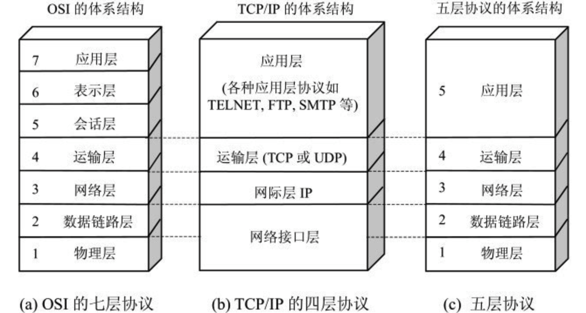

1. 应用层

   应用层的任务是通过应用进程间的交互来完成特定网络应用。应用层协议定义的是应用进程间通信和交互的规则。在因特网中的应用层协议很多，如支持万维网应用的 HTTP 协议，支持电子邮件的 SMTP 协议，支持文件传送的 FTP 协议，等等。

2. 运输层

   运输层的任务就是负责向两个主机中进程之间的通信提供通用的数据传输服务。运输层主要使用以下两种协议：

   - 传输控制协议 TCP (Transmission ControlProtocol)——提供面向连接的、可靠的数据传输服务，其数据传输的单位是报文段(segment)。
   - 用户数据报协议 UDP (User DatagramProtocol)——提供无连接的、尽最大努力(best-effort)的数据传输服务（不保证数据传输的可靠性），其数据传输的单位是用户数据报。

3. 网络层

   网络层负责为分组交换网上的不同主机提供通信服务。在 TCP/IP 体系中，由于网络层使用 IP 协议，因此分组也叫作 IP 数据报。网络层的另一个任务就是要选择合适的路由，使源主机运输层所传下来的分组能够通过网络中的路由器找到目的主机。

4. 数据链路层

   在两个相邻结点之间传送数据时，数据链路层将网络层交下来的 IP 数据报组装成帧（framing），在两个相邻结点间的链路上传送帧（frame）。每一帧包括数据和必要的控制信息（如同步信息、地址信息、差错控制等）。数据链路层在收到一个帧后，就可从中提取出数据部分，上交给网络层。

5. 物理层

   在物理层上所传数据的单位是比特，即 1 或 0。因此物理层要考虑用多大的电压代表“1”或“0”，以及接收方如何识别出发送方所发送的比特，等等。

**数据在各层之间的传递过程如图所示：**

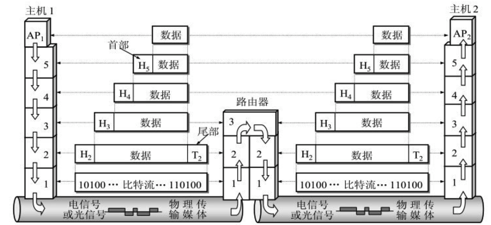

## 物理层

物理层考虑的是怎样才能在连接各种计算机的传输媒体上传输数据比特流，而不是指具体的传输媒体。可以将物理层的主要任务描述为确定与传输媒体的接口有关的一些特性，即：

1. **机械特性** 指明接口所用接线器的形状和尺寸，引脚数目和排列，固定和锁定装置，等等。平时常见的各种规格的接插件都有严格的标准化的规定。

2. **电气特性** 指明在接口电缆的各条线上出现的电压的范围。

3. **功能特性** 指明某条线上出现的某一电平的电压表示何种意义。

4. **过程特性** 指明对于不同功能的各种可能事件的出现顺序。

## 数据链路层

链路是从一个结点到相邻结点的一段物理线路，数据链路则是在链路的基础上增加了一些必要的硬件（如网络适配器）和软件（如协议的实现）。

数据链路层使用的信道主要有以下两种类型：

1. **点对点信道**。这种信道使用一对一的点对点通信方式。
2. **广播信道**。这种信道使用一对多的广播通信方式，因此过程比较复杂。广播信道上连接的主机很多，因此必须使用专用的共享信道协议来协调这些主机的数据发送。

点对点协议 PPP 是数据链路层使用的最多的一种协议。

### 点对点信道

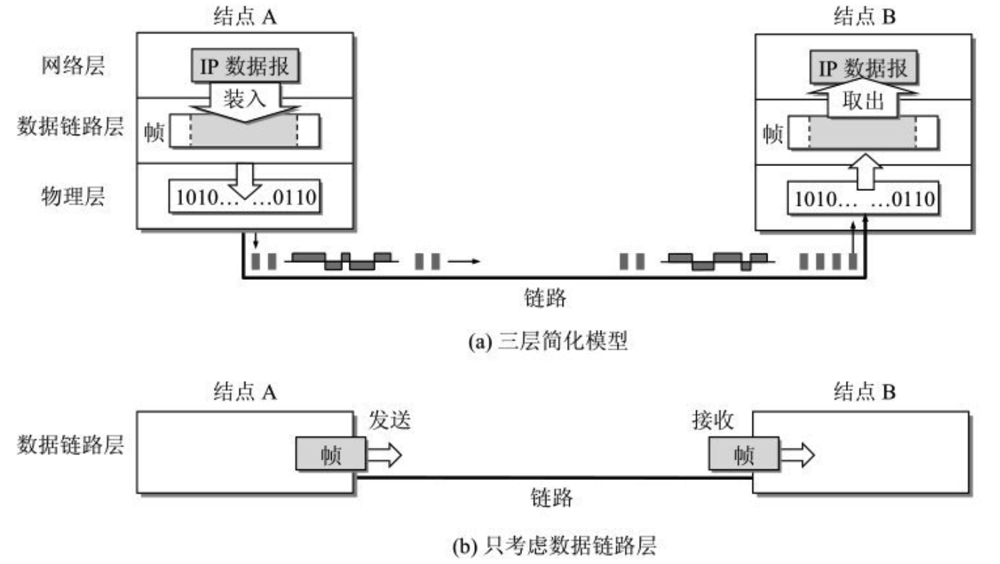

点对点信道的数据链路层在进行通信时的主要步骤如下：

1. 结点 A 的数据链路层把网络层交下来的 IP 数据报添加首部和尾部封装成帧。

2. 结点 A 把封装好的帧发送给结点 B 的数据链路层。

3. 若结点 B 的数据链路层收到的帧无差错，则从收到的帧中提取出 IP 数据报上交给上面的网络层；否则丢弃这个帧。

## 网络层

TCP/IP 体系中的网络层向上只提供简单灵活的、无连接的、尽最大努力交付的数据报服务。网络层不提供服务质量的承诺，不保证分组交付的时限，所传送的分组可能出错、丢失、重复和失序。进程之间的通信的可靠性由运输层负责。

### 网际协议 IP

网际协议 IP 是 TCP/IP 体系中两个最主要的协议之一，也是最重要的因特网标准协议之一。与 IP 协议配套使用的还有三个协议：

- 地址解析协议 ARP (Address ResolutionProtocol)
- 网际控制报文协议 ICMP (Internet ControlMessage Protocol)
- 网际组管理协议 IGMP (Internet GroupManagement Protocol)

整个的因特网就是一个单一的、抽象的网络。IP 地址就是给因特网上的每一个主机（或路由器）的每一个接口分配一个在全世界范围是唯一的 32 位的标识符。IP 地址的编址方法共经过了三个历史阶段：

1. 分类的 IP 地址。
2. 子网的划分。
3. 构成超网。

### 分类的 IP 地址

所谓“分类的 IP 地址”就是将 IP 地址划分为若干个固定类，每一类地址都由两个固定长度的字段组成，其中第一个字段是网络号(net-id)，它标志主机（或路由器）所连接到的网络。一个网络号在整个因特网范围内必须是唯一的。第二个字段是主机号(host-id)，它标志该主机（或路由器）。一个主机号在它前面的网络号所指明的网络范围内必须是唯一的。由此可见，一个 IP 地址在整个因特网范围内是唯一的。

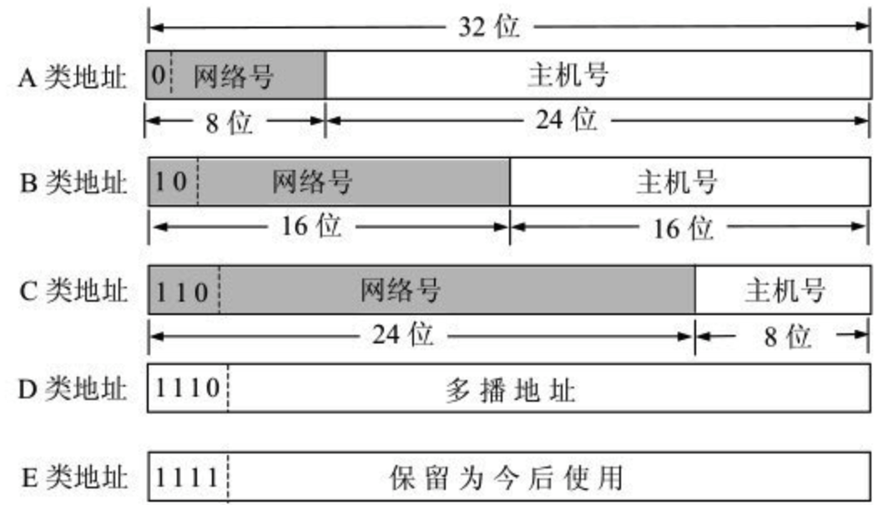

从 IP 地址的结构来看，IP 地址并不仅仅指明一个主机，而是还指明了主机所连接到的网络。

IP 地址点分十进制的记法：

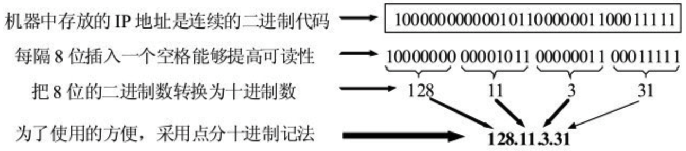

### 划分子网

划分子网的方法是从网络的主机号借用若干位作为子网号 subnet-id，当然主机号也就相应减少了同样的位数。于是两级 IP 地址在本单位内部就变为三级 IP 地址：**网络号**、**子网号**和**主机号**。凡是从其他网络发送给本单位某个主机的 IP 数据报，仍然是根据 IP 数据报的目的网络号找到连接在本单位网络上的路由器。但此路由器在收到 IP 数据报后，再按目的网络号和子网号找到目的子网，把 IP 数据报交付目的主机。

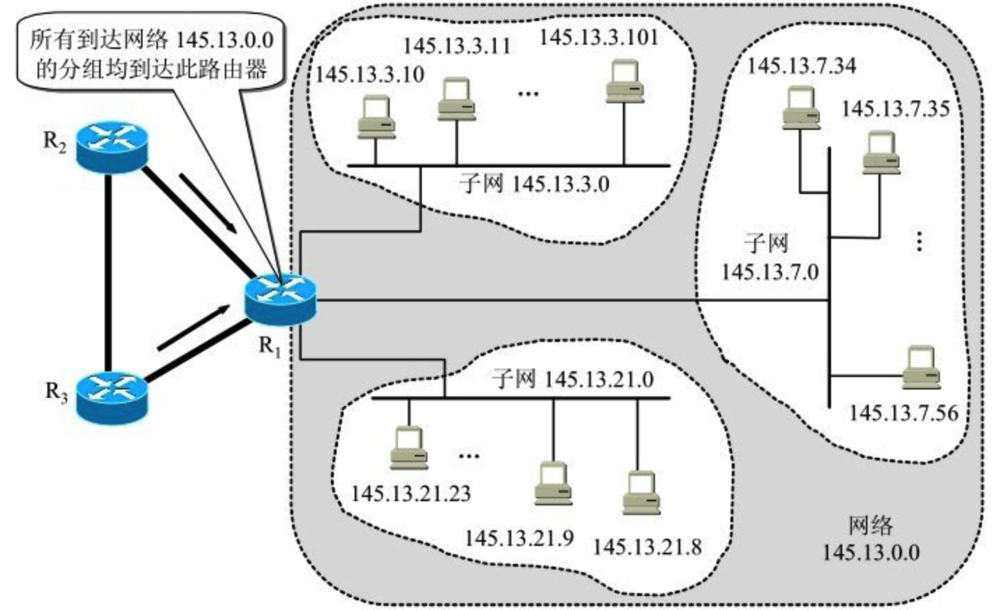

如图所示：

一个 B 类 IP 地址，网络地址是 145.13.0.0（网络号是 145.13）。凡目的地址为 145.13.x.x 的数据报都被送到这个网络上的路由器 R~1~。假定子网号占用 8 位，因此在增加了子网号后，主机号就只有 8 位。所划分的三个子网分别是：145.13.3.0，145.13.7.0 和 145.13.21.0。在划分子网后，整个网络对外部仍表现为一个网络，其网络地址仍为 145.13.0.0。但网络 145.13.0.0 上的路由器 R~1~ 在收到外来的数据报后，再根据数据报的目的地址把它转发到相应的子网。

那么，如何区分一个 IP 地址是二级结构？还是三级子网机构？答案是使用**子网掩码**。

### IP 地址与硬件地址

硬件地址也称为物理地址，物理地址是数据链路层和物理层使用的地址，而 IP 地址是网络层和以上各层使用的地址，是一种逻辑地址。

在发送数据时，数据从高层下到低层，然后才到通信链路上传输。使用 IP 地址的 IP 数据报一旦交给了数据链路层，就被封装成 MAC 帧了。MAC 帧在传送时使用的源地址和目的地址都是硬件地址，这两个硬件地址都写在 MAC 帧的首部中。

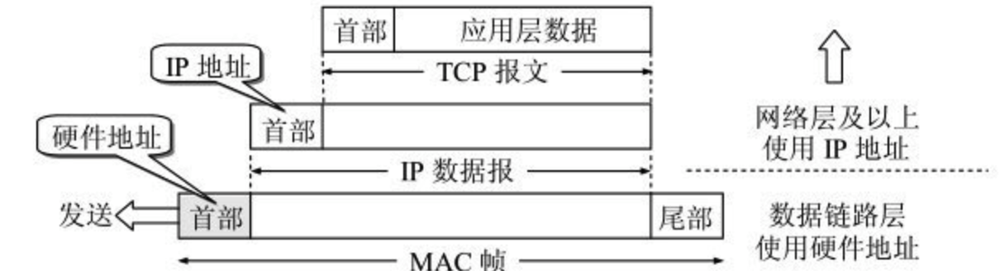

IP 地址放在 IP 数据报的首部，而硬件地址则放在 MAC 帧的首部。在网络层和网络层以上使用的是 IP 地址，而数据链路层及以下使用的是硬件地址。

### IP 数据报的格式

在 TCP/IP 的标准中，各种数据格式常常以 32 位(即 4 字节)为单位来描述。下图是 IP 数据报的完整格式。

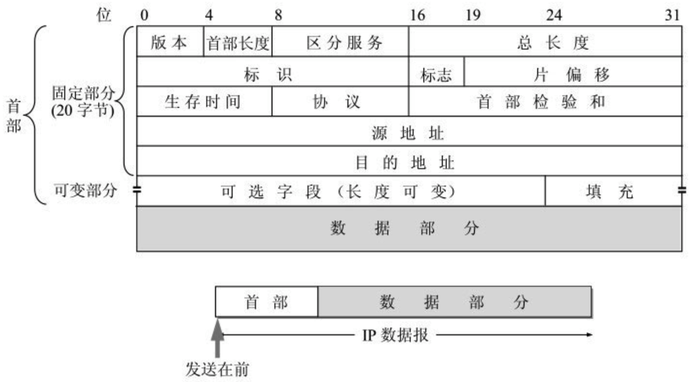

IP 数据报分为首部和数据两部分。首部的前一部分是固定长度，共 20 字节，是所有 IP 数据报必须具有的（源地址、目的地址、总长度等重要字段都在固定首部中）。一些长度可变的可选字段放在固定首部的后面。

详细说明参考《计算机网络》（第 6 版 谢希仁 ）的 4.2.5 章节。

## 运输层

运输层向它上面的应用层提供通信服务，它属于面向通信部分的最高层，同时也是用户功能中的最低层。

IP 协议能够把源主机 A 发送出的分组按照首部中的目的地址送交到目的主机 B，那么，为什么还需要运输层呢？

从 IP 层来说，通信的两端是两个主机。IP 数据报的首部明确地标志了这两个主机的 IP 地址。但“两个主机之间的通信”这种说法还不够清楚。这是因为，真正进行通信的实体是在主机中的进程，是这个主机中的一个进程和另一个主机中的一个进程在交换数据（即通信）。因此严格地讲，两个主机进行通信就是两个主机中的应用进程互相通信。IP 协议虽然能把分组送到目的主机，但是这个分组还停留在主机的网络层而没有交付主机中的应用进程。从运输层的角度看，**通信的真正端点并不是主机而是主机中的进程**。

**网络层是为主机之间提供逻辑通信，而运输层为应用进程之间提供端到端的逻辑通信。**

TCP/IP 运输层的两个主要协议都是因特网的正式标准，即：

1. 用户数据报协议 UDP (User Datagram Protocol)
2. 传输控制协议 TCP (Transmission Control Protocol)

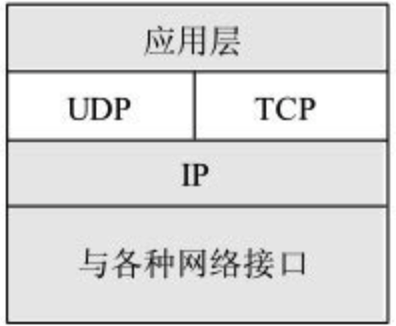

### UDP

1. UDP 是**无连接的**，即发送数据之前不需要建立连接（当然，发送数据结束时也没有连接可释放），因此减少了开销和发送数据之前的时延。
2. UDP 使用尽最大努力交付，即不保证可靠交付，因此主机不需要维持复杂的连接状态表。
3. UDP 是面向报文的。对应用层交下来的报文，既不合并，也不拆分，应用层交给 UDP 多长的报文，UDP 就照样发送。
4. UDP 没有拥塞控制，因此网络出现的拥塞不会使源主机的发送速率降低。
5. UDP 支持一对一、一对多、多对一和多对多的交互通信。
6. UDP 的首部开销小，只有 8 个字节，比 TCP 的 20 个字节的首部要短。

### TCP

1. TCP 提供**面向连接的服务**。在传送数据之前必须先建立连接，数据传送结束后要释放连接。
2. 每一条 TCP 连接只能有两个端点(endpoint)，每一条 TCP 连接只能是点对点的（一对一）。TCP 不提供广播或多播服务。
3. TCP 提供可靠交付的服务。通过 TCP 连接传送的数据，无差错、不丢失、不重复、并且按序到达。
4. TCP 提供全双工通信。TCP 允许通信双方的应用进程在任何时候都能发送数据。TCP 连接的两端都设有发送缓存和接收缓存，用来临时存放双向通信的数据。
5. 面向字节流。虽然应用程序和 TCP 的交互是一次一个数据块（大小不等），但 TCP 把应用程序交下来的数据看成仅仅是一连串的无结构的字节流。

由于 TCP 要提供可靠的、面向连接的运输服务，因此不可避免地增加了许多的开销，如确认、流量控制、计时器以及连接管理等。

#### TCP 的连接

TCP 连接的端点叫做套接字(socket)或插口，`套接字 socket = （IP 地址:端口号）`，即套接字的表示方法是在点分十进制的 IP 地址后面写上端口号，中间用冒号或逗号隔开。比如，192.3.4.5:80。

---

通俗的讲，UDP 就像发短信，不需要事先拨通对方电话，不需要关注对方网络状态，只管自己发出短信。TCP 就像打电话，要先拨通对方电话，才能开始沟通。

使用 UDP 和 TCP 协议的各种应用和应用层协议：

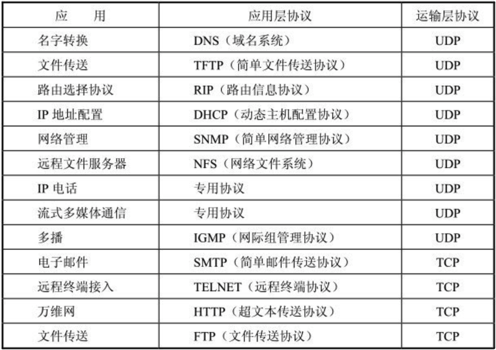

### 端口号

当运输层收到 IP 层交上来的运输层报文时，就能够根据其首部中的目的端口号把数据交付应用层的目的应用进程，剩下的工作（即最后交付目的进程）就由 TCP 来完成。

端口号为 16 位，所以一台计算机中可以允许有 2^16^ ，即 0 ~ 65535 的端口号。其中：

- 0 ~ 1023 为熟知端口号，一般指派给 TCP/IP 最重要的一些应用程序；
- 1024 ~ 49151 为登记端口号；
- 49152 ~ 65535 为短暂端口号，留给客户进程选择临时使用。

常见的熟知端口号：
| 应用程序 | 端口号 |
| :-----------: | :-----------: |
| FTP | 21 |
| TELNET | 23 |
| SMTP | 25 |
| DNS | 53 |
| TFTP | 69 |
| HTTP | 80 |
| SNMP | 161 |
| HTTPS | 443 |

## 应用层

运输层为应用提供了端到端的通信服务，不同的网络应用的`应用进程`之间的通信则需要应用层协议。

应用层协议包括以下常见类型：

- 域名系统 DNS 协议。
- FTP 文件传输协议。
- TELNET 远程终端协议
- HTTP（超文本传输协议），万维网的应用层协议。
- SMTP 电子邮件协议。
- POP3 邮件读取协议。
- ...

::: warning
应用层协议与网络应用并不是同一个概念。应用层协议只是网络应用的一部分。
:::

什么是应用？

以万维网为例，万维网浏览器、万维网服务器等都属于万维网应用。

### 域名系统 DNS

域名系统 DNS (Domain Name System)是因特网使用的命名系统，用来把便于人们使用的机器名字转换为 IP 地址。

用户与因特网上某个主机通信时，必须要知道对方的 IP 地址。然而用户很难记住长达 32 位二进制主机地址。即使是点分十进制 IP 地址也并不太容易记忆。但在应用层为了便于用户记忆各种网络应用，更多的是使用主机名字。比如我们访问必应网站时，只需要输入域名 <https://cn.bing.com/> 即可，而不是输入它的 IP 地址。

#### 域名结构

如图所示：域名以从右向左的顺序，依次为顶级域名、二级域名、三级域名、等等...

常见的顶级域名有：

- .com，公司企业
- .cn，中国
- .us，美国
- .net，网络服务机构
- .edu，教育机构
- ...

#### 域名服务器

DNS 服务器的管辖范围是以”区“为单位的，每一个区设置相应的权限域名服务器(authoritative name server)，用来保存该区中的所有主机的域名到 IP 地址的映射。区可能等于或小于域，但一定不可能大于域。

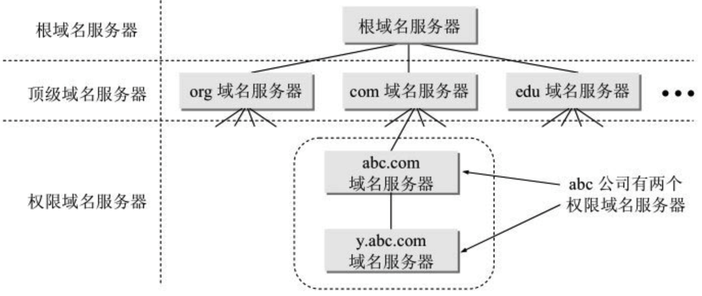

1. 根域名服务器

   根域名服务器是最高层次的域名服务器，也是最重要的域名服务器。所有的根域名服务器都知道所有的顶级域名服务器的域名和 IP 地址。根域名服务器是最重要的域名服务器，因为不管是哪一个本地域名服务器，若要对因特网上任何一个域名进行解析（即转换为 IP 地址），只要自己无法解析，就首先要求助于根域名服务器。

   需要注意的是，在许多情况下，根域名服务器并不直接把待查询的域名直接转换成 IP 地址（根域名服务器也没有存放这种信息），而是告诉本地域名服务器下一步应当找哪一个顶级域名服务器进行查询。

2. 顶级域名服务器

   这些域名服务器负责管理在该顶级域名服务器注册的所有二级域名。当收到 DNS 查询请求时，就给出相应的回答（可能是最后的结果，也可能是下一步应当找的域名服务器的 IP 地址）。

3. 权限域名服务器

   这就是前面已经讲过的负责一个区的域名服务器。当一个权限域名服务器还不能给出最后的查询回答时，就会告诉发出查询请求的 DNS 客户，下一步应当找哪一个权限域名服务器。

4. 本地域名服务器

   当一个主机发出 DNS 查询请求时，这个查询请求报文会先发送给本地域名服务器，也称为默认域名服务器。当所要查询的主机也属于同一个本地 ISP 时，该本地域名服务器立即就能将所查询的主机名转换为它的 IP 地址，而不需要再去询问其他的域名服务器。

**域名是如何解析的呢？**

首先了解两个概念：

1. 递归查询

   如果主机所询问的本地域名服务器不知道被查询域名的 IP 地址，那么本地域名服务器就以 DNS 客户的身份，向其他根域名服务器继续发出查询请求报文（即替该主机继续查询），而不是让该主机自己进行下一步的查询。因此，递归查询返回的查询结果或者是所要查询的 IP 地址，或者是报错，表示无法查询到所需的 IP 地址。

2. 迭代查询

   当根域名服务器收到本地域名服务器发出的迭代查询请求报文时，要么给出所要查询的 IP 地址，要么告诉本地域名服务器：“你下一步应当向哪一个域名服务器进行查询”。然后让本地域名服务器进行后续的查询（而不是替本地域名服务器进行后续的查询）。

如下图所示：

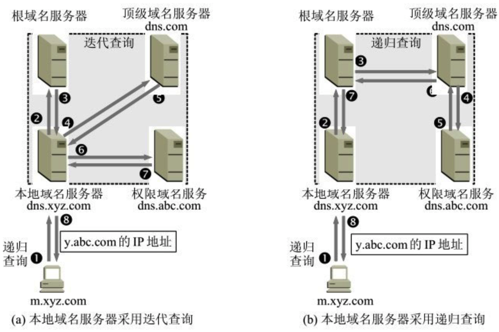

图中(a)的查询步骤：

1. 主机 m.xyz.com 先向其本地域名服务器 dns.xyz.com 进行递归查询。
2. 本地域名服务器采用迭代查询。它先向一个根域名服务器查询。
3. 根域名服务器告诉本地域名服务器，下一次应查询的顶级域名服务器 dns.com 的 IP 地址。
4. 本地域名服务器向顶级域名服务器 dns.com 进行查询。
5. 顶级域名服务器 dns.com 告诉本地域名服务器，下一次应查询的权限域名服务器 dns.abc.com 的 IP 地址。
6. 本地域名服务器向权限域名服务器 dns.abc.com 进行查询。
7. 权限域名服务器 dns.abc.com 告诉本地域名服务器，所查询的主机的 IP 地址。
8. 本地域名服务器最后把查询结果告诉主机 m.xyz.com。

::: warning

- 主机向本地域名服务器的查询一般都是采用递归查询。

- 本地域名服务器向根域名服务器的查询通常是采用迭代查询。当然，本地域名服务器也可以采用递归查询，这取决于最初的查询请求报文的设置是要求使用哪一种查询方式。

:::

### 超文本传输协议 HTTP

每个万维网网点都有一个服务器进程，它不断地监听 TCP 的端口 80，以便发现是否有浏览器向它发出连接建立请求。一旦监听到连接建立请求并建立了 TCP 连接之后，浏览器就向万维网服务器发出浏览某个页面的请求，服务器接着就返回所请求的页面作为响应。最后，TCP 连接就被释放了。在浏览器和服务器之间的请求和响应的交互，必须按照规定的格式和遵循一定的规则。这些格式和规则就是超文本传送协议 HTTP。

**当在浏览器中输入一个 URL 并发起请求时，都发生了什么呢？**

1. 浏览器分析链接指向页面的 URL（比如是：<https://www.baidu.com/>）。
2. 浏览器向 DNS 请求解析 www.baidu.com 的 IP 地址。
3. 域名系统 DNS 解析出对应服务器的 IP 地址。
4. 浏览器与服务器建立 TCP 连接。
5. 浏览器发出取文件命令。
6. 服务器给出响应，把文件 index.htm 发送给浏览器。
7. 释放 TCP 连接。
8. 浏览器显示百度页面内容。

#### HTTP 状态码

HTTP 状态码都是三位数字的，分为 5 大类。

- 1xx，表示通知信息的，如请求收到了或正在进行处理。
- 2xx，表示成功，如接受或知道了。
- 3xx，表示重定向，如要完成请求还必须采取进一步的行动。
- 4xx，表示客户端差错，如请求中有错误的语法或不能完成。
- 5xx，表示服务端差错，如服务器失效无法完成请求。

## 参考

- 《计算机网络》（第 6 版 谢希仁 ）
